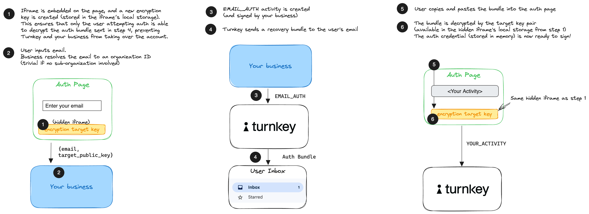

# Example: `email-auth-local-storage`

This example shows a complete email auth flow using a locally stored target embedded key. It contains a NextJS app with:

- a frontend application
- a backend application

The overall flow for email auth is outlined below:
. For more information on email auth, [check out our documentation](https://docs.turnkey.com/features/email-auth).

This example contains an auth page as well and enables you to create wallets using an email auth credential. Unlike our other [email auth example](https://github.com/tkhq/sdk/tree/main/examples/email-auth), this does not use an iframe, which typically houses a target embedded key. Instead, a target embedded key is created within the application itself and stored in local storage.

## Getting started

### 1/ Cloning the example

Make sure you have `node` installed locally; we recommend using Node v18+.

```bash
$ git clone https://github.com/tkhq/sdk
$ cd sdk/
$ corepack enable  # Install `pnpm`
$ pnpm install -r  # Install dependencies
$ pnpm run build-all  # Compile source code
$ cd examples/email-auth-local-storage/
```

### 2/ Setting up Turnkey

The first step is to set up your Turnkey organization and account. By following the [Quickstart](https://docs.turnkey.com/getting-started/quickstart) guide, you should have:

- A public/private API key pair for Turnkey
- An organization ID

Once you've gathered these values, add them to a new `.env.local` file. Notice that your API private key should be securely managed and **_never_** be committed to git.

```bash
$ cp .env.local.example .env.local
```

Now open `.env.local` and add the missing environment variables:

- `API_PUBLIC_KEY`
- `API_PRIVATE_KEY`
- `NEXT_PUBLIC_ORGANIZATION_ID`
- `NEXT_PUBLIC_BASE_URL` (the `NEXT_PUBLIC` prefix makes the env variable accessible to the frontend app)

### 3/ Running the app

```bash
$ pnpm run dev
```

This command will run a NextJS app on port 3000. If you navigate to http://localhost:3000 in your browser, you can follow the prompts to start an email auth.
